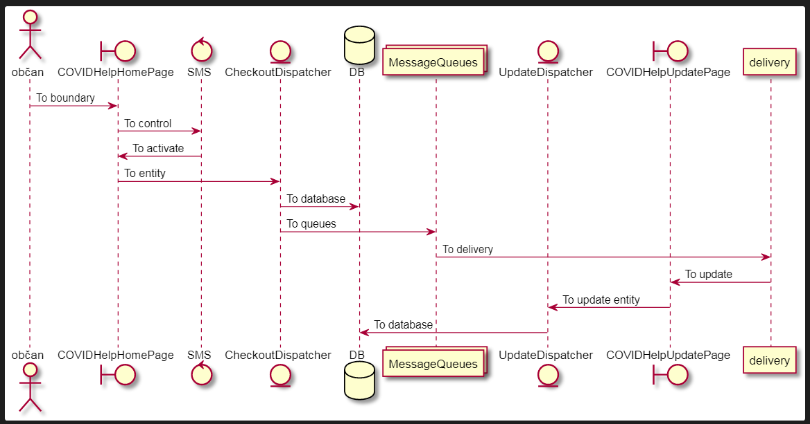

This project was bootstrapped with [Create React App](https://github.com/facebook/create-react-app).

This is the fronted web app helping to people handle Covid19 infections with request for help. (in Slovak language)

This is the status web app helping to people handle Covid19 infections with request for help. (in Slovak language)

## Available Scripts

In the project directory, you can run:

### `yarn start`
### `npm start`

Runs the app in the development mode. 
Open [http://localhost:3000](http://localhost:3000) to view it in the browser.

The page will reload if you make edits. 
You will also see any lint errors in the console.

### `yarn test`

Launches the test runner in the interactive watch mode. 
See the section about [running tests](https://facebook.github.io/create-react-app/docs/running-tests) for more information.

### `yarn build`

Builds the app for production to the `build` folder. 
It correctly bundles React in production mode and optimizes the build for the best performance.

The build is minified and the filenames include the hashes. 
Your app is ready to be deployed!

### Diagrams

Diagrams tell the application story, first use case, who using what

The sequence -> is used to draw a message between participants, how using what

Class diagram, entity relations, domain driven design who with who

